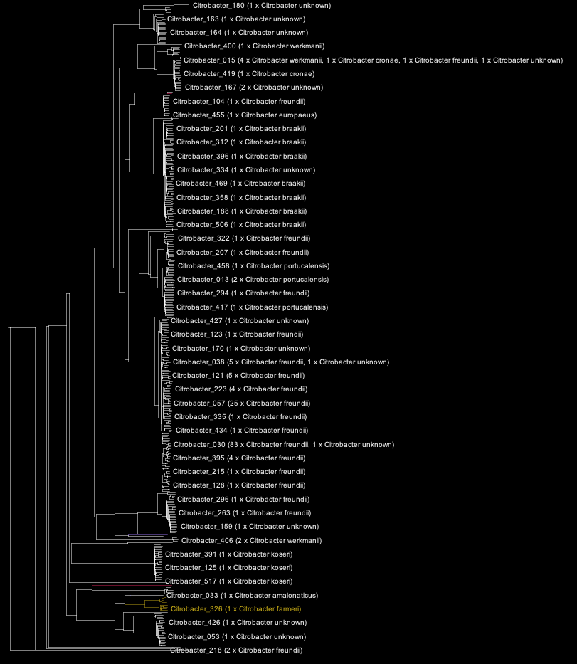
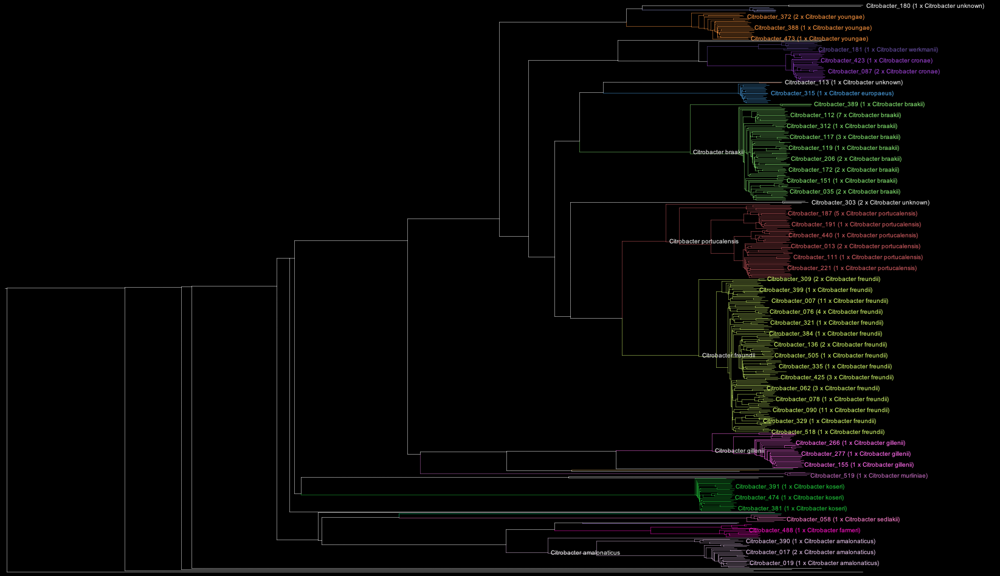

```{r setup, include=FALSE}
knitr::opts_chunk$set(echo = TRUE)
```

## Bacsort set-up

1. Download and install Bacsort

```git clone https://github.com/rrwick/Bacsort.git```

2. Create a conda environment for our dependencies. Note we need numpy 1.14 or
higher, but this is included in the yaml file.

```conda env create -n bacsort -c bioconda -f misc/bacsort.yaml```

Then we activate our conda environment:

```conda activate bacsort```

3. Download assemblies

```
#Create a new directory to work in
mkdir bacsort_citro
cd bacsort_citro

#Define the genomes we want to download
download_genomes.sh "Citrobacter"
```

4. Cluster assemblies

```cluster_genera.py assemblies```

5. Generate distance matrices

First we generate a mash-based distance matrix

```mash_distance_matrix.sh 16```

Then we generate a fastANI-based distance matrix. This step is slow so we did it
with many threads on an HPC.

```fastani_in_parallel.sh 50```

We then converted this into a PHYLIP distance matrix:

```
pairwise_identities_to_distance_matrix.py --max_dist 0.2 tree/fastani_output > tree/fastani.phylip
```

And then we combined the Mash and FastANI distances:

```
combine_distance_matrices.py tree/fastani.phylip tree/mash.phylip > tree/distances.phylip
```

6. Tree building

Next we built our tree:

```bionj_tree.R tree/distances.phylip tree/tree.newick```

7. Tree curation

We then made another tree with the species labels at the (collapsed) tips.

```find_species_clades.py```

The tree can be seen below. Clades which were perfectly defined (i.e. contained
all instances of a species and no other species) were colourised. Prior to
manual curation, the tree looked like this:



After curation of the taxonomic labels of genomes, it looked like this:



```
for f in *; do echo -e ${f} genomes "\t" Bacsort:$(ls ${f}/* | wc -l) internal:$(grep -v "GCF" "../citrobacter_species_ERQ.txt" | grep $f | wc -l); done

amalonaticus genomes     Bacsort:63 internal:1
arsenatis genomes        Bacsort:1 internal:0
braakii genomes          Bacsort:164 internal:17
cronae genomes   Bacsort:54 internal:0
europaeus genomes        Bacsort:27 internal:0
farmeri genomes          Bacsort:17 internal:0
freundii genomes         Bacsort:467 internal:31
gillenii genomes         Bacsort:39 internal:2
koseri genomes   Bacsort:106 internal:0
murliniae genomes        Bacsort:6 internal:0
pasteurii genomes        Bacsort:8 internal:1
portucalensis genomes    Bacsort:118 internal:4
rodentium genomes        Bacsort:7 internal:0
sedlakii genomes         Bacsort:10 internal:0
telavivensis genomes     Bacsort:2 internal:0
tructae genomes          Bacsort:1 internal:0
unknown genomes          Bacsort:26 internal:0
werkmanii genomes        Bacsort:9 internal:0
youngae genomes          Bacsort:36 internal:9
```

# To do

* Add yaml file for bacsort